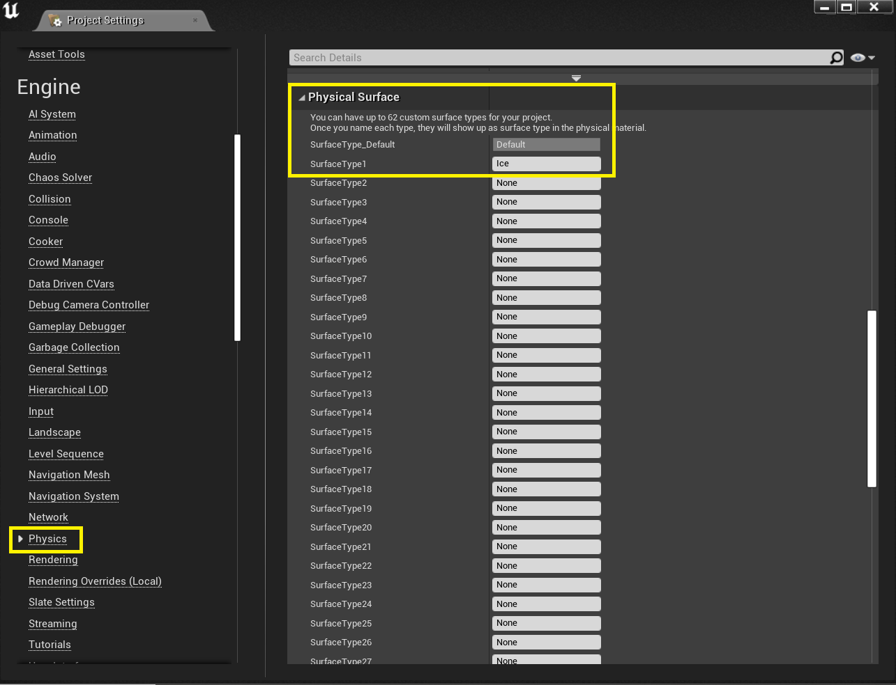

### Creating the Physics Material

[previous](../initial-blueprint/README.md) • [home](../README.md) • [next](../calculate-floor-normal/README.md)

In order to exercise more control over how the player reacts physically to the surface of the platform, we can create a physical material which some custom properties.

 

---

##### `Step 1.`\|`ITA`|:small_blue_diamond:

Right click in the Materials folder, and under <b>Create Advanced Asset | Physics</b> and create a Physical Material. Name this <b>PM_ICE</b>. In the next window, select Physical Material as the class.

 

##### `Step 2.`\|`FHIU`|:small_blue_diamond: :small_blue_diamond: 

Let’s leave the values as they are for now. Go to your project settings and scroll down to the `Engine | Physics` section. Scroll within the Physics window and find the Physical Surface section. Type “Ice” in one of the empty SurfaceTypes to define a new custom surface.

 

##### `Step 3.`\|`ITA`|:small_blue_diamond: :small_blue_diamond: :small_blue_diamond:

Close this window and go back to the PM_Ice we just made. In the bottom-most section (Physical Properties), select your new Ice type from the Surface Type dropdown.

 

##### `Step 4.`\|`ITA`|:small_blue_diamond: :small_blue_diamond: :small_blue_diamond: :small_blue_diamond:

Now we can make a Material for our cube that can take on these properties. In your Materials folder, make a new Material called <b>M_Ice</b>. Open it up and make a Constant3Vector to connect to the Base Color. You can make it any color you like.

 

##### `Step 5.`\|`ITA`| :small_orange_diamond:

Click on the Result Node of the material (that’s the big node on the right) and look at the Physical Material section. Here we can assign the new Ice physical material we just made. Simply click on the dropdown and select your <b>PM_Ice</b>. Hit <b>Apply</b> when done.

##### `Step 6.`\|`ITA`| :small_orange_diamond: :small_blue_diamond:

That's all for the physical material. Next we'll use the ThirdPersonCharacter to make decisions about the current slope, before applying the appropriate physics. Commit your changes and submit to source control.

___

| [previous](../initial-blueprint/README.md)| [home](../README.md) | [next](../calculate-floor-normal/README.md)|
|---|---|---|
